# AMG Integration Platform × AI Questionnaire Engine — Unified Architecture Design

> **Project Vision:** Combine AMG Integration Platform's file routing & connectivity capabilities with the AI Questionnaire Engine's intelligent document processing to deliver a fully automated, end-to-end questionnaire response pipeline with centralized knowledge management.

---

## 1. High-Level System Context

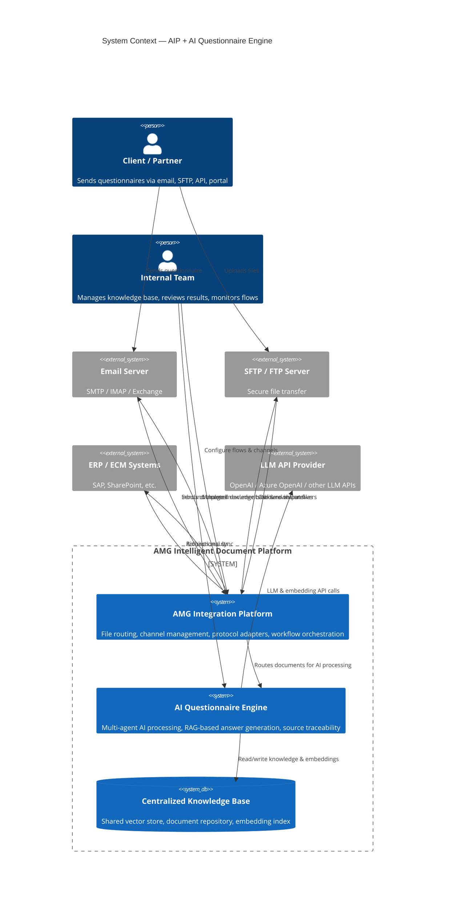

---

## 2. Integrated Platform Architecture

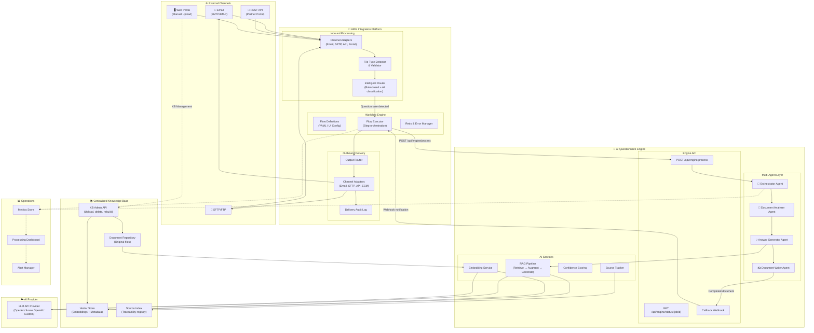

---

## 3. End-to-End Processing Flow

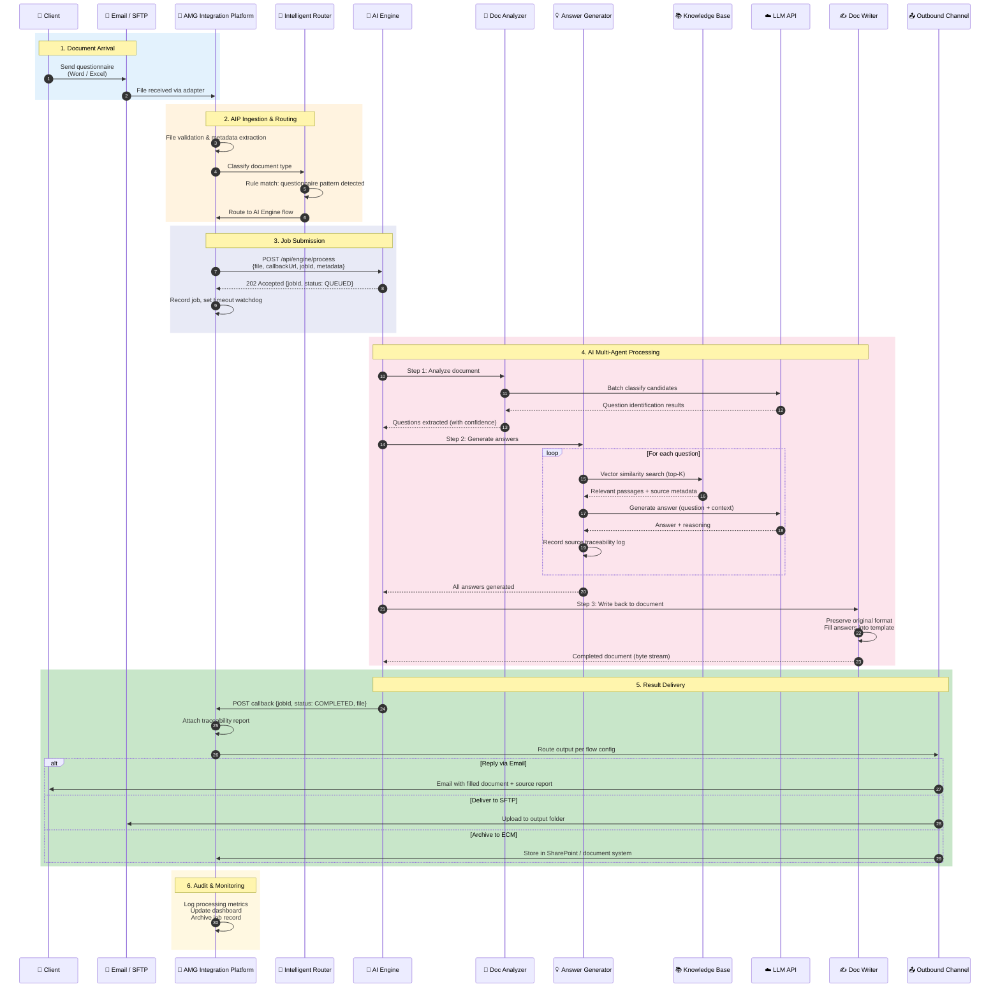

---

## 4. Centralized Knowledge Base Architecture

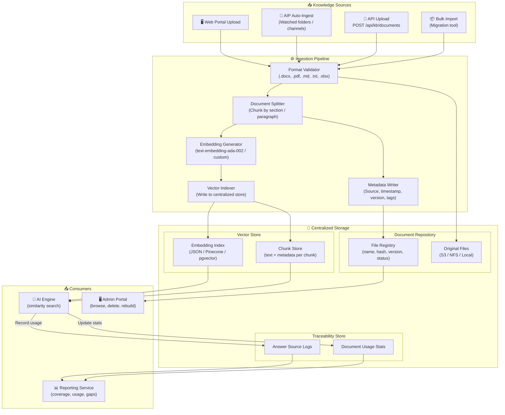

---

## 5. Deployment Architecture

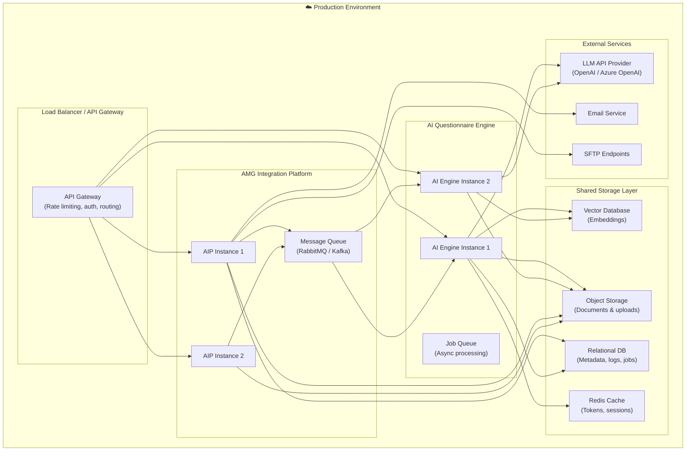

---

## 6. API Contract Between AIP and AI Engine

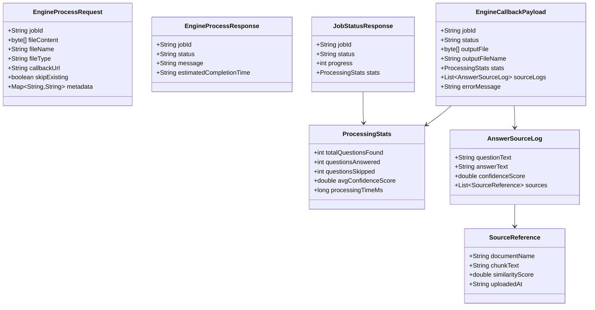

### API Endpoints

| Endpoint                     | Method | Description                          | Called By                |
| ---------------------------- | ------ | ------------------------------------ | ------------------------ |
| `/api/engine/process`        | POST   | Submit document for async processing | AIP → AI Engine          |
| `/api/engine/status/{jobId}` | GET    | Poll job processing status           | AIP → AI Engine          |
| `/api/engine/cancel/{jobId}` | POST   | Cancel a running job                 | AIP → AI Engine          |
| `/api/kb/documents`          | POST   | Upload document to knowledge base    | AIP / Portal → AI Engine |
| `/api/kb/documents`          | GET    | List all KB documents                | Admin Portal             |
| `/api/kb/documents/{id}`     | DELETE | Remove document from KB              | Admin Portal             |
| `/api/kb/stats`              | GET    | Knowledge base statistics            | Dashboard                |
| `/api/kb/rebuild`            | POST   | Rebuild vector index                 | Admin Portal             |
| `{callbackUrl}`              | POST   | Deliver completed result             | AI Engine → AIP          |

---

## 7. Flow Configuration Example (AIP Side)

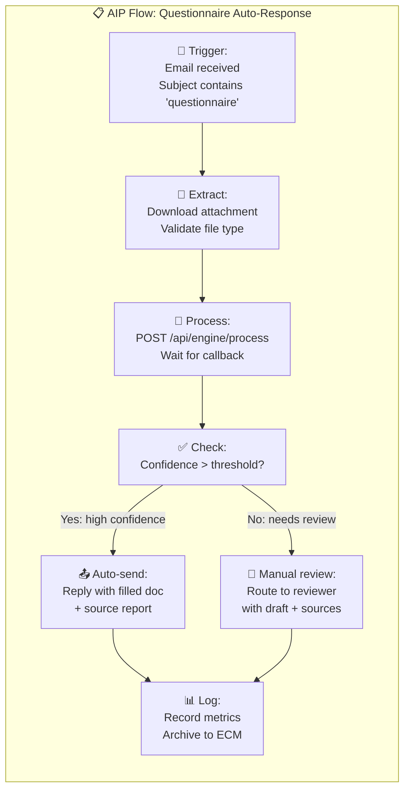

---

## 8. User Feedback & Continuous Improvement Loop

The system supports a closed-loop feedback mechanism: reviewers can accept, edit, or reject AI-generated answers. Feedback data is used to improve future answer quality and track reviewer confidence over time.

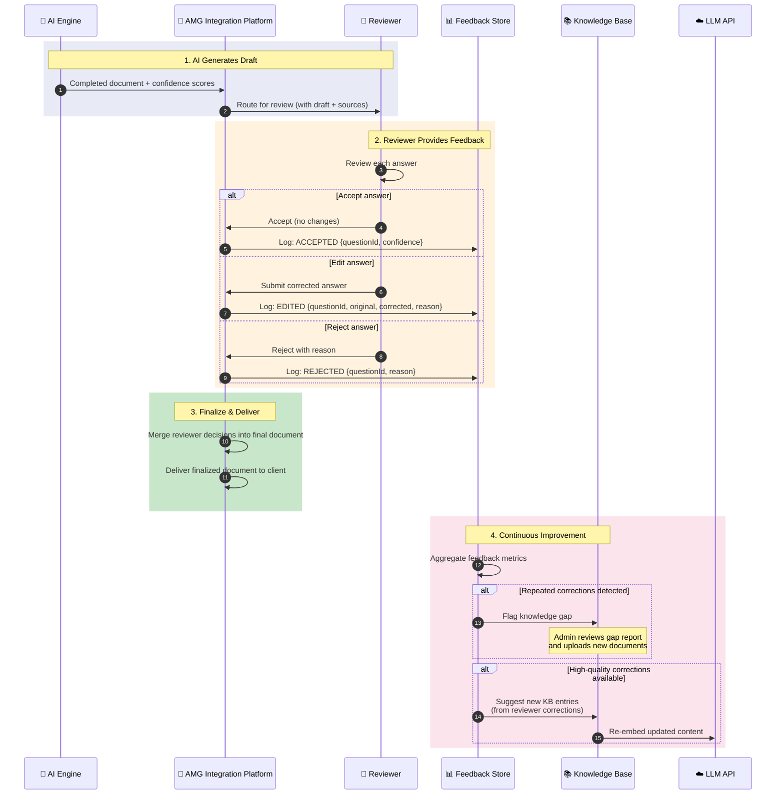

### Feedback Data Model

| Field             | Type      | Description                              |
| ----------------- | --------- | ---------------------------------------- |
| `jobId`           | String    | Processing job reference                 |
| `questionId`      | String    | Specific question identifier             |
| `action`          | Enum      | ACCEPTED / EDITED / REJECTED             |
| `originalAnswer`  | String    | AI-generated answer                      |
| `correctedAnswer` | String    | Reviewer's corrected version (if edited) |
| `rejectionReason` | String    | Why the answer was rejected              |
| `confidenceScore` | Double    | AI confidence at generation time         |
| `reviewerNotes`   | String    | Free-text reviewer comment               |
| `reviewedAt`      | Timestamp | When the review happened                 |
| `reviewerId`      | String    | Who performed the review                 |

### Feedback Metrics Dashboard

- **Acceptance rate** — % of answers accepted without changes
- **Edit rate** — % of answers that needed correction
- **Rejection rate** — % of answers fully rejected
- **Avg confidence vs outcome** — correlation between AI confidence and reviewer action
- **Knowledge gap report** — topics with high rejection/edit rates
- **Reviewer turnaround time** — time from draft to finalized document

---

## 9. User Review & Approval Workflow

The review workflow supports configurable approval policies: auto-approve for high-confidence answers, single-reviewer for medium confidence, and multi-reviewer escalation for low confidence or sensitive topics.

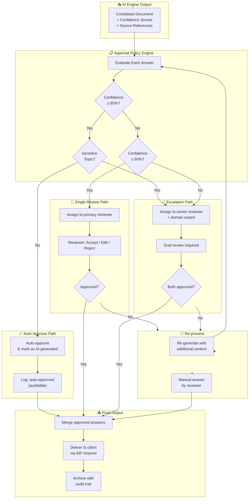

### Approval Policy Configuration

```yaml
approval:
  policies:
    auto-approve:
      min-confidence: 0.85
      exclude-topics: ["financial", "legal", "regulatory"]
      require-source-count: 2 # At least 2 source references
    single-review:
      min-confidence: 0.60
      max-confidence: 0.85
      assign-to: "primary-reviewer-pool"
      sla-hours: 24
    escalation:
      below-confidence: 0.60
      sensitive-topics: ["financial", "legal", "regulatory"]
      assign-to: ["senior-reviewer", "domain-expert"]
      require-unanimous: true
      sla-hours: 48
  notifications:
    on-assignment: true
    on-sla-breach: true
    channels: ["email", "slack"]
```

---

## 10. Knowledge Base Auto-Update Mechanism

The knowledge base evolves continuously through four automated channels: scheduled document scans, feedback-driven gap detection, AIP-ingested new documents, and version-controlled content refresh.

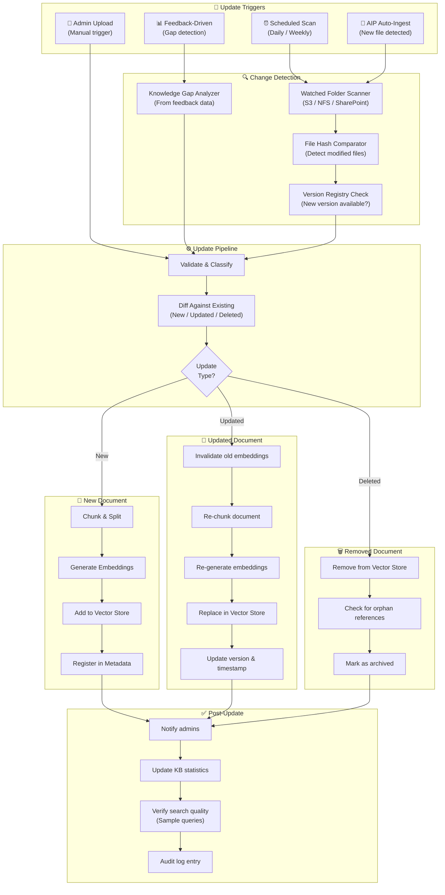

### Auto-Update Configuration

```yaml
knowledge-base:
  auto-update:
    enabled: true

    # Scheduled scanning
    schedule:
      cron: "0 2 * * *" # Daily at 2 AM
      full-rebuild-cron: "0 3 * * 0" # Weekly full rebuild on Sunday

    # Watched sources
    sources:
      - type: s3
        bucket: company-policies
        prefix: /approved/
        watch-interval: 300 # Check every 5 minutes
      - type: sharepoint
        site: compliance-team
        library: Final Documents
        watch-interval: 600
      - type: amg-channel
        channel-id: kb-ingest
        auto-process: true

    # Change detection
    detection:
      hash-algorithm: SHA-256
      track-versions: true
      max-file-size-mb: 100

    # Feedback-driven updates
    feedback-integration:
      enabled: true
      gap-threshold: 3 # Flag topic after 3 rejections
      auto-suggest-from-edits: true
      min-corrections-for-suggestion: 5

    # Quality verification
    verification:
      enabled: true
      sample-query-count: 10
      min-relevance-score: 0.7
      alert-on-degradation: true

    # Notifications
    notifications:
      on-new-document: true
      on-update: true
      on-delete: true
      on-gap-detected: true
      channels: ["email", "slack", "dashboard"]
```

### KB Health Monitoring

| Metric                           | Description                                      | Alert Threshold |
| -------------------------------- | ------------------------------------------------ | --------------- |
| **Document freshness**           | Age of newest document per topic                 | > 90 days       |
| **Coverage score**               | % of question topics with matching KB content    | < 80%           |
| **Stale embedding ratio**        | % of embeddings older than source document       | > 10%           |
| **Gap report count**             | Unresolved knowledge gaps from feedback          | > 5 open        |
| **Search quality score**         | Avg relevance of top-K results on sample queries | < 0.7           |
| **Update pipeline success rate** | % of auto-updates completed without error        | < 95%           |

---

## 11. Migration Roadmap

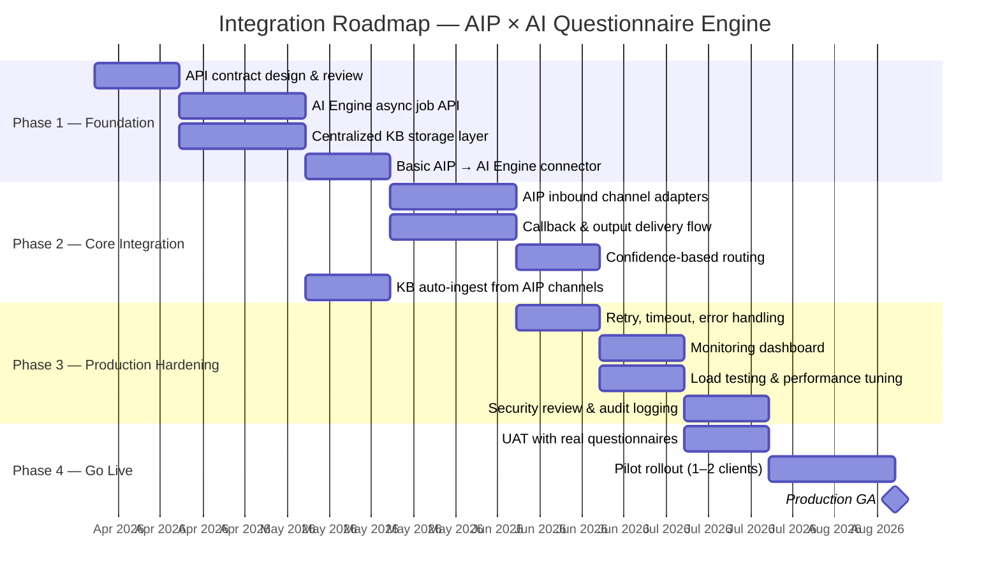

---

## 12. Key Design Decisions

| Decision                     | Choice                                       | Rationale                                                         |
| ---------------------------- | -------------------------------------------- | ----------------------------------------------------------------- |
| **Communication pattern**    | Async (job queue + callback)                 | Questionnaire processing takes 30s–5min; sync calls would timeout |
| **Knowledge base ownership** | AI Engine owns KB; AIP feeds documents       | Single source of truth for embeddings; AIP handles file routing   |
| **Vector store**             | Start with JSON-based, migrate to pgvector   | JSON works for MVP; pgvector scales for production                |
| **File storage**             | Shared object storage (S3 / NFS)             | Both AIP and AI Engine need access to original files              |
| **Auth for AI API**          | Centralized token service with cache         | Avoid per-request OAuth overhead; token reuse via Redis           |
| **Confidence routing**       | AIP decides based on AI Engine scores        | Business rules stay in AIP; AI Engine focuses on processing       |
| **Traceability**             | Source logs stored in centralized DB         | Accessible by both dashboard and compliance reports               |
| **Retry strategy**           | AIP handles retries with exponential backoff | AI Engine is stateless per job; AIP owns workflow state           |
| **Feedback loop**            | Reviewer corrections feed back into KB       | Continuous improvement; answers get better over time              |
| **Review workflow**          | Confidence-based tiered approval             | Auto-approve high confidence; escalate sensitive/low confidence   |
| **KB auto-update**           | Scheduled scan + feedback-driven gap fill    | Knowledge stays fresh without manual intervention                 |

---

## 13. Unified Product Positioning

```
┌─────────────────────────────────────────────────────────────────┐
│              AMG Intelligent Document Platform                   │
│         "From File Integration to File Intelligence"            │
├─────────────────────────────┬───────────────────────────────────┤
│  AMG Integration Platform   │   AI Questionnaire Engine         │
│  ─────────────────────────  │   ──────────────────────────────  │
│  • Channel management       │   • Multi-agent AI processing     │
│  • Protocol adapters        │   • RAG-based answer generation   │
│  • Workflow orchestration   │   • Source traceability            │
│  • File routing & delivery  │   • Centralized knowledge base    │
│  • Retry & error handling   │   • Confidence scoring            │
│  • Audit logging            │   • Format-preserving output      │
├─────────────────────────────┴───────────────────────────────────┤
│              Shared Infrastructure                               │
│  • Object storage  • Vector DB  • Message queue  • Monitoring   │
└─────────────────────────────────────────────────────────────────┘
```

**Investor pitch (one sentence):**

> "AIP already routes millions of files across enterprise channels. Now we're adding an AI intelligence layer that _understands_ and _responds to_ those documents — starting with automated questionnaire processing, with contract review and RFP automation next."
